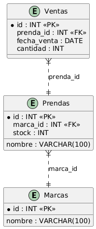

# ProyectoDesarrollo
Proyecto Desarrollo de Plataformas abierta. Universidad Florencio Del Castillo. I Cuatrimestre del 2025

## Descripción del Proyecto
Este proyecto consiste en la creación y gestión de una base de datos para una tienda de ropa. La base de datos contempla marcas, prendas y ventas, con el objetivo de organizar y mantener un registro detallado de las operaciones de la tienda.Donde esto luego se va a ver relacionado a un desarrollo de prgramacion por capas.

## Estructura del Proyecto
- **scripts**: Carpeta que contiene el archivo `operaciones_base_de_datos.sql` con todas las instrucciones SQL necesarias para crear y gestionar la base de datos.

## Diagrama de la Estructura de la Base de Datos

## Lista de Integrantes del Proyecto
- Bryan Castro Castillo

